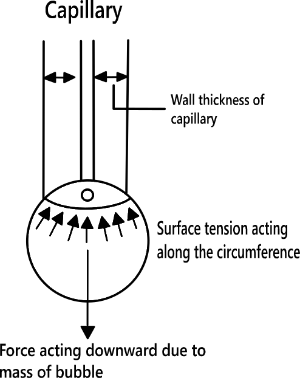
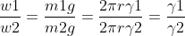
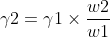
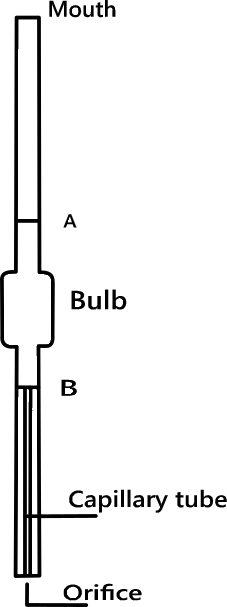

### Theory :

This method is based on the principle that the weight of a drop falling slowly out of a capillary held vertically is directionally proportional to its surface tension. The drop falls down when its weight just exceeds surface tension. When the drop just breaks away, the force pulling it upwards is:

  
2&pi;r&gamma;

Where,  
r	=  Radius of capillary.     
&gamma;	= surface tension. 

Weight acting downward w= mg

At equilibrium: 2&pi;r&gamma;= mg

For two liquids the drops of which fall almost at the same rate out of the same capillary 

 Surface tension of required solution

 

Where, W1 and W2 => Weights of liquids

&gamma;1 and &gamma;2 => the surface tension of liquids

The apparatus used for determining surface tension of a liquid is known as stalagmometer. It resembles a pipette with a bulb in the middle and a mark A on the tube above the bulb. The lower portion is made up of a capillary with a flattened tip.

